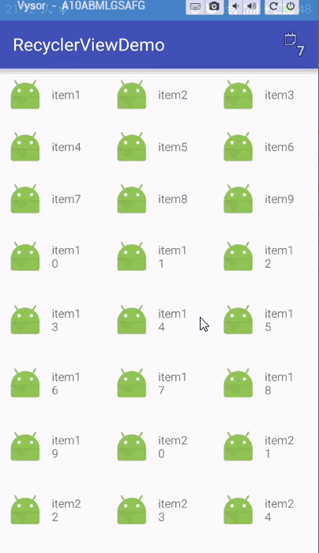
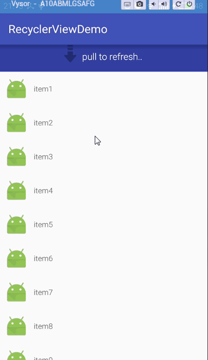

## RecyclerView 下拉刷新（pullToRefresh）和加载更多(LoadMore)

``to be continue..``
　　还在优化设计阶段，当前版本只针对 **Orientation** 为 **VERTICAL** 情况

### V 1.0
- 为普通的RecyclerView 增加下拉刷新头
- 增加加载更多的footer
- 简单接口能快速实现更丰富的动画效果
- 更友好的配置选项和实现方式，更优雅的完成加载

### 演示动画


### 如何使用
1. ``需要下拉刷新头和加载更多时``，使用
```
        RecyclerWrapper.bindOn(mRecyclerView)
                .layoutBy(mLayoutManager)
                .withRefreshHeader(mView, mOnRefreshListener)
                .withLoadMoreFooter(loadingView, mOnLoadMoreListener)
                .setAdapter(mAdapter)
                .build();
```
当然，也可以简单使用 ``Header``
```
            RecyclerWrapper.bindOn(mRecyclerView)
                   .withRefreshHeader(mView, mOnRefreshListener)
                   .build();
```
或者 ``Footer``
```
            RecyclerWrapper.bindOn(mRecyclerView)
                .withLoadMoreFooter(loadingView, mOnLoadMoreListener)
                .build();
```
来简单追加头部或尾部。
> LayoutManager 和 Adapter 可以使用recyclerView的set来设置。

OK,Done.应用可以快速使用起来了。

2. 如果想根据滑动距离来增加复杂的刷新动画效果，可以继承 implements ``IRefreshHeader``
　　Make a flexiable Animate Header

```
public interface IRefreshHeader {
    void onVisibleHeightChanged(int visibleHeight);

    void onRefresh();

    void onComplete();
}

//eg:自定义头部示例
public class MyRefreshHeader extends View implements IRefreshHeader{
    //...
}

```
使用同上。**withRefreshHeader(mView, mOnRefreshListener)**

效果：


不实现该接口就视为简单动画View，实现IRefreshHeader接口则响应回调。实现原理：
```
  withRefreshHeader(View header,onRefreshListener onRefreshListener){
        //...
        if(header instanceof IRefreshHeader){
            iRefreshHeader = (IRefreshHeader)header;
        }
  }
  
  //...
  if(null!+iRefreshHeader) iRefreshHeader.onVisibleHeightChanged
```